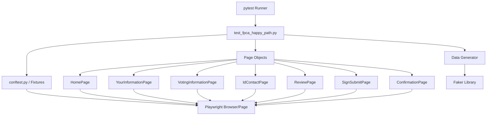
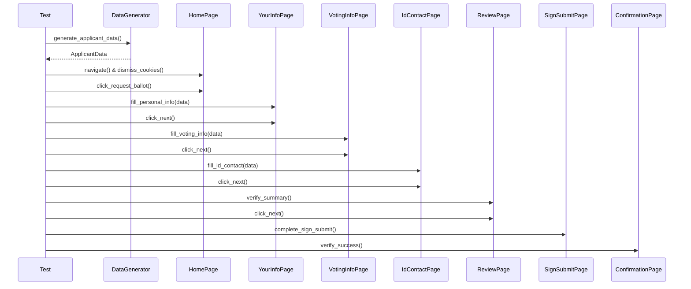
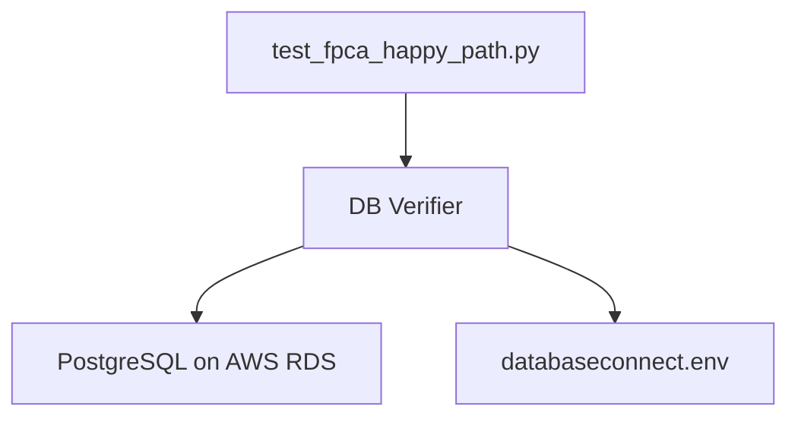
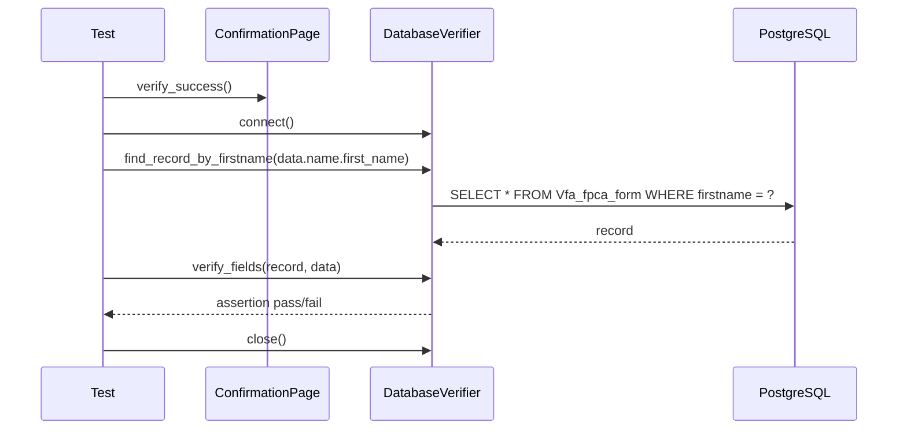

# Design Document: Playwright Test Suite

## Overview

This design describes a single end-to-end Playwright "happy path" test implemented in Python with pytest-playwright. The test automates the complete FPCA (Federal Post Card Application) ballot request form on the VoteFromAbroad development site (`https://vfa-newux.netlify.app/`), filling every field with randomly generated data and verifying successful submission.

The architecture follows the **Page Object Model (POM)** pattern, separating page interaction logic from test orchestration. A dedicated data generation layer uses the [Faker](https://faker.readthedocs.io/) library to produce realistic, randomized test data for each run.

**Key design decisions:**
- **Playwright over Selenium**: The target site is a Nuxt 3 (Vue) SPA with custom form components that don't respond to standard Selenium clicks. Playwright's true browser-level event dispatch and auto-waiting handle Vue's reactive event system natively.
- POM pattern chosen for maintainability — if selectors change, only one page class needs updating.
- Faker library chosen over custom random generation for realistic, locale-aware data.
- Playwright's built-in auto-waiting used exclusively — no manual sleep calls — for reliable SPA transitions.
- pytest-playwright fixtures manage browser lifecycle (setup/teardown) ensuring clean state per test.

---

## Architecture



### Project Structure

```
VFATest02/
├── requirements.txt           # Python dependencies
├── pytest.ini                 # pytest configuration
├── conftest.py                # Fixtures (browser/page setup)
├── data/
│   ├── __init__.py
│   └── generator.py           # Data generation module
├── pages/
│   ├── __init__.py
│   ├── base_page.py           # Base page object with shared utilities
│   ├── home_page.py           # Homepage interactions
│   ├── your_information_page.py
│   ├── voting_information_page.py
│   ├── id_contact_page.py
│   ├── review_page.py
│   ├── sign_submit_page.py
│   └── confirmation_page.py
└── tests/
    ├── __init__.py
    ├── test_data_generator.py   # Property-based tests
    └── test_fpca_happy_path.py  # Main E2E test
```

### Flow Sequence



---

## Components and Interfaces

### 1. conftest.py — pytest Fixtures

Leverages pytest-playwright's built-in fixtures. The `page` fixture is provided automatically by pytest-playwright with browser lifecycle management.

```python
import pytest

@pytest.fixture(scope="session")
def browser_context_args(browser_context_args):
    """Configure browser context with viewport and timeout."""
    return {
        **browser_context_args,
        "viewport": {"width": 1920, "height": 1080},
    }
```

**Responsibilities:**
- Configure viewport size for consistent rendering
- pytest-playwright handles browser launch/teardown automatically
- Headless/headed mode controlled via `--headed` CLI flag or `HEADED` env var
- Browser type controlled via `--browser` CLI flag (defaults to chromium)

### 2. BasePage — Shared Page Utilities

All page objects inherit from `BasePage`.

```python
from playwright.sync_api import Page, expect

class BasePage:
    PAGE_TRANSITION_TIMEOUT = 15_000  # milliseconds
    FIELD_INTERACTION_TIMEOUT = 5_000  # milliseconds

    def __init__(self, page: Page): ...
    def wait_for_url_contains(self, path: str) -> None: ...
    def click_next_button(self) -> None: ...
```

**Design rationale:** Playwright's auto-waiting eliminates the need for explicit `wait_for_element_clickable` and `wait_for_element_visible` methods. The `page.locator()` API automatically waits for elements to be actionable before interacting. Only URL-based navigation waits are needed explicitly.

### 3. Page Objects (one per form step)

Each page object encapsulates:
- Element locators (Playwright locator strings — CSS, text, role, or test-id selectors)
- Interaction methods (`fill_*`, `select_*`, `click_*`)
- Validation methods (`verify_*`)

**Key Playwright advantages for this site:**
- `page.get_by_text()` / `page.get_by_role()` — semantic selectors that work with Vue's rendered DOM
- `locator.click()` — dispatches real browser events that Vue's event system recognizes
- `locator.fill()` — sets input values AND triggers input/change events (critical for Vue v-model)
- Auto-waiting — no stale element exceptions from Vue re-renders

| Page Object | Key Methods |
|---|---|
| `HomePage` | `navigate()`, `dismiss_cookie_banner()`, `click_request_ballot()` |
| `YourInformationPage` | `fill_title()`, `fill_name()`, `fill_phone()`, `fill_email()`, `fill_address_abroad()`, `click_next()` |
| `VotingInformationPage` | `fill_us_address()`, `select_voter_category()`, `click_next()` |
| `IdContactPage` | `fill_dob()`, `select_sex()`, `fill_ssn_last4()`, `select_party()`, `select_dems_abroad()`, `click_next()` |
| `ReviewPage` | `verify_summary_displayed()`, `click_next()` |
| `SignSubmitPage` | `skip_signature()`, `select_email_delivery()`, `click_next()`, `click_send_email()` |
| `ConfirmationPage` | `verify_success()` |

### 4. DataGenerator — Test Data Factory

```python
class DataGenerator:
    def __init__(self, locale: str = "en_US"): ...
    def generate_applicant_data(self) -> ApplicantData: ...
    def generate_name(self) -> NameData: ...
    def generate_phone(self) -> str: ...
    def generate_email(self) -> str: ...
    def generate_dob(self, min_age: int = 18) -> DateOfBirth: ...
    def generate_us_address(self) -> USAddress: ...
    def generate_abroad_address(self) -> AbroadAddress: ...
    def generate_ssn_last4(self) -> str: ...
```

**Identical to Selenium version** — the data generation layer is framework-agnostic.

### 5. Test Module — test_fpca_happy_path.py

Single test function that orchestrates the entire flow:

```python
def test_fpca_happy_path(page: Page) -> None:
    """Complete FPCA form submission with randomly generated data."""
    data = DataGenerator().generate_applicant_data()
    # ... page object interactions ...
```

The `page` fixture is injected by pytest-playwright.

---

## Data Models

```python
from dataclasses import dataclass
from typing import Optional


@dataclass
class NameData:
    title: str        # "Miss", "Ms.", "Mrs.", "Mr."
    first_name: str
    middle_name: str
    last_name: str
    suffix: str       # "Sr.", "Jr.", "II", "III", "IV"


@dataclass
class DateOfBirth:
    month: str        # Full month name (e.g., "January")
    day: int          # 1-31
    year: int         # e.g., 1985


@dataclass
class USAddress:
    street: str
    city: str
    state: str        # 2-letter abbreviation
    zip_code: str     # 5-digit string


@dataclass
class AbroadAddress:
    country: str      # Country name (not "United States")
    address_line1: str
    city: str
    state_province: str
    zip_code: str


@dataclass
class ApplicantData:
    name: NameData
    phone: str             # 10-digit US phone number
    email: str             # Valid email format
    dob: DateOfBirth       # Age >= 18
    us_address: USAddress
    abroad_address: AbroadAddress
    ssn_last4: str         # Exactly 4 digits
    voter_category: Optional[str]  # Selected at runtime from available options
    sex: Optional[str]             # Selected at runtime
    party: Optional[str]           # Selected at runtime
    dems_abroad: Optional[str]     # Selected at runtime
```

---

## Site-Specific Implementation Notes

Based on investigation of the VFA site's actual DOM structure:

### Form Element Patterns

| Element | HTML Pattern | Playwright Selector Strategy |
|---|---|---|
| Title buttons (Mr., Ms., etc.) | `<button><span>Mr.</span></button>` | `page.get_by_role("button", name="Mr.")` |
| Suffix spans (Jr., Sr., etc.) | `<span class="cursor-pointer">Jr.</span>` | `page.locator("span.cursor-pointer", has_text="Jr.")` |
| Previous Name No button | `<button id="rb_previousName_no">` | `page.locator("#rb_previousName_no")` |
| Phone input | `<input id="vfaititel">` | `page.locator("#vfaititel")` |
| Email input | `<input type="email">` | `page.locator('input[type="email"]')` |
| Email confirm button | `<button id="rb_emailAddressVerified_true">` | `page.locator("#rb_emailAddressVerified_true")` |
| Country typeahead | `<input placeholder="...type to find your country.">` | `page.get_by_placeholder("type to find your country")` |
| Name fields | `<input id="id_firstName">` etc. | `page.locator("#id_firstName")` |
| Abroad address | `<input id="id_abrAdr_A">` etc. | `page.locator("#id_abrAdr_A")` |
| Next button | `<button id="id_pages_request_stage_next_01">` | `page.locator("#id_pages_request_stage_next_01")` |
| State dropdown | `<select id="id_select_states">` | `page.locator("#id_select_states")` |
| Cookie Accept | `<b>Accept All</b>` inside span | `page.get_by_text("Accept All")` |
| Request Ballot | `<button id="btn_landing_page">` | `page.locator("#btn_landing_page")` |

### Country Typeahead Strategy

The country input is a Vue component that:
1. Requires clicking/focusing the input
2. Typing triggers autocomplete filtering
3. Playwright's `locator.fill()` triggers Vue's reactivity (unlike Selenium)
4. After typing, press Enter or click the suggestion to confirm

Strategy: `page.get_by_placeholder("type to find your country").fill("Canada")` followed by keyboard Enter or waiting for the suggestion to appear.

---

## Correctness Properties

The correctness properties are identical to the Selenium version — they apply to the Data Generator layer which is framework-agnostic.

### Property 1: Generated names are always non-empty strings
### Property 2: Generated emails are always valid format
### Property 3: Generated phone numbers are always exactly 10 numeric digits
### Property 4: Generated dates of birth always represent adults aged 18 or older
### Property 5: Generated US addresses have valid state code and zip format
### Property 6: Generated SSN last-4 is always exactly 4 numeric digits

---

## Error Handling

### Browser Initialization Failures

| Scenario | Handling | User-Visible Behavior |
|---|---|---|
| Playwright browsers not installed | Error from playwright.chromium.launch() | pytest reports error with message to run `playwright install` |
| Network timeout during page load | Playwright's built-in timeout | Test fails with descriptive timeout message |

### Page Transition Timeouts

| Scenario | Handling | User-Visible Behavior |
|---|---|---|
| URL doesn't change within 15s | `page.wait_for_url()` timeout | Test fails with: `"Page transition timeout: expected URL to contain '{path}'"` |
| Element not actionable within 5s | Playwright auto-wait timeout | Test fails with Playwright's built-in error message |

### Cookie Banner Edge Cases

| Scenario | Handling | User-Visible Behavior |
|---|---|---|
| Banner never appears | 5-second timeout, then proceed | Test continues normally |
| Banner doesn't disappear after click | 3-second timeout | Test continues (may fail later if banner blocks) |

---

## Testing Strategy

### Dual Testing Approach

#### 1. Property-Based Tests (Data Generator Layer)

**Library:** Hypothesis  
**Configuration:** 100 examples per property  
**Identical to Selenium version** — data layer is framework-agnostic.

#### 2. Integration / End-to-End Test (Playwright Layer)

**What's tested:**
- Full happy-path form submission
- Cookie banner dismissal
- All page transitions (URL assertions)
- Form submission and confirmation verification

### Test Execution

```bash
# Run property-based tests only (fast, no browser needed)
pytest tests/test_data_generator.py -v

# Run the E2E happy path test (requires Playwright browsers)
pytest tests/test_fpca_happy_path.py -v

# Run headed (visible browser)
pytest tests/test_fpca_happy_path.py --headed -v

# Run all tests
pytest -v

# Use specific browser
pytest tests/test_fpca_happy_path.py --browser firefox -v
```

### Dependencies

```
# requirements.txt
playwright>=1.40.0
pytest>=7.4.0
pytest-playwright>=0.4.0
hypothesis>=6.92.0
faker>=20.0.0
```

Note: After installing, run `playwright install chromium` to download the browser binary.


---

## Database Verification Component

### Overview

After the E2E test confirms successful form submission via the confirmation page, a database verification step queries the PostgreSQL backend to confirm the submitted data was persisted correctly. A 4-character random suffix appended to the first name ensures each test run produces a unique, searchable record.

### Architecture Addition



### 6. DatabaseVerifier — DB Verification Module

```python
class DatabaseVerifier:
    def __init__(self, env_path: str = "databaseconnect.env"): ...
    def connect(self) -> None: ...
    def find_record_by_firstname(self, firstname: str, timeout: int = 30) -> dict | None: ...
    def verify_fields(self, record: dict, expected: ApplicantData) -> None: ...
    def close(self) -> None: ...
```

**Location:** `data/db_verify.py`

**Responsibilities:**
- Load DB credentials from `databaseconnect.env` using `python-dotenv`
- Connect to PostgreSQL via `psycopg2`
- Query `Vfa_fpca_form` table by firstname (with unique suffix) with polling/retry up to 30 seconds
- Assert that `firstname`, `lastname`, `email`, and `dob` match expected values
- Close connection on completion

### Data Flow



### First Name Uniqueness Strategy

The `DataGenerator.generate_name()` method appends a 4-character random alphanumeric suffix to the first name:

```python
import string
suffix = ''.join(random.choices(string.ascii_lowercase + string.digits, k=4))
first_name = self.fake.first_name() + suffix
```

This ensures each test run writes a unique firstname to the database, allowing the verification query to unambiguously locate the correct record without timestamp-based filtering.

### Dependencies Addition

```
# requirements.txt (additions)
psycopg2-binary>=2.9.9
python-dotenv>=1.0.0
```

### Error Handling

| Scenario | Handling | User-Visible Behavior |
|---|---|---|
| DB connection failure | psycopg2.OperationalError caught | Test fails with "Cannot connect to database: {error}" |
| Record not found within 30s | Polling loop timeout | Test fails with "Record not found in database for firstname '{name}'" |
| Field mismatch | AssertionError | Test fails with "DB field '{field}' expected '{expected}' got '{actual}'" |
| Missing .env file | FileNotFoundError | Test fails with "databaseconnect.env not found" |

